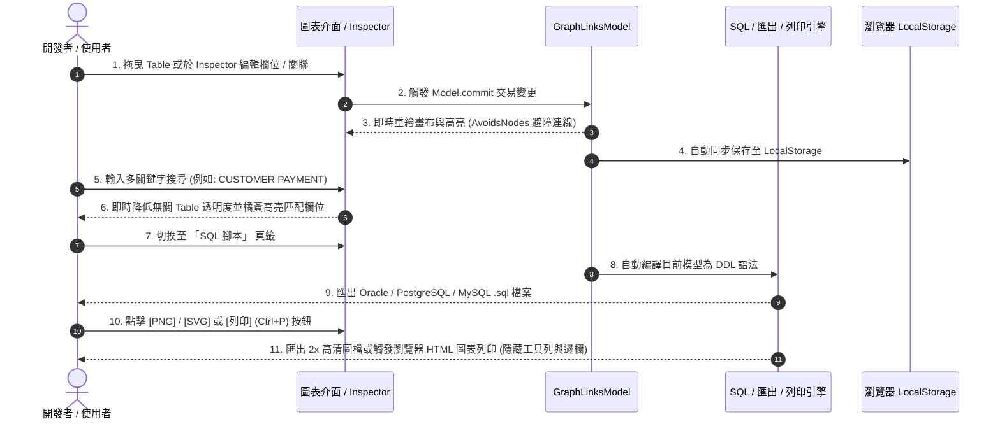
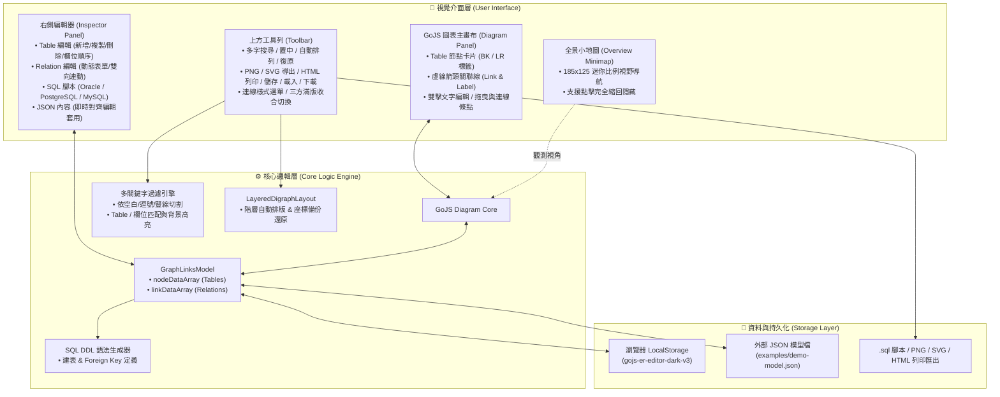

# GoJS ER Diagram Editor

一個純前端、現代化、支援暗黑模式 (Dark Mode) 的微型 GoJS ER 圖形化編輯器。提供完整 Table CRUD、Relation CRUD、SQL 建表腳本自動產生、高清 PNG/SVG 圖片匯出、列印 HTML 圖表畫面、多關鍵字全內容搜尋與可縮回三方面板。

---

## 💡 開發動機與背景 (Motivation & Background)

在資料庫架構設計與系統維護過程中，開發團隊與架構師常面臨以下痛點：
1. **軟體繁重且跨平台不便**：傳統 ER 圖設計工具（如 Navicat, ERwin, PowerDesigner）需要安裝龐大的桌面軟體，軟體授權與跨平台成本高。
2. **缺乏現代化深色視覺體驗**：許多網頁版圖表工具樣式簡陋、操作卡頓，且不支援暗黑模式 (Dark Mode)，長時間進行複雜 ER 設計容易視覺疲勞。
3. **資料庫腳本與圖表同步困難**：畫完 ER 圖後往往需要手動編寫與維護 `CREATE TABLE` 或 `FOREIGN KEY` 語法；若欄位改名，關聯線極易錯位或遺漏。
4. **圖表匯出與文檔紀錄需求**：傳統工具難以一鍵匯出高清 2x PNG / SVG 向量圖，或缺少無干擾的 HTML 直接列印／存為 PDF 功能。

**GoJS ER Diagram Editor** 的出現，就是為了打破這些限制！我們打造了一個 **「零安裝、秒開啟、視覺極佳、功能完備、開箱即用」** 的網頁版 ER Diagram 編輯器。

---

## 🌟 專案核心優點與特色 (Key Advantages & Highlights)

### ⚡ 1. 極輕量與零依賴 (Zero Installation & Zero Framework)
- **免安裝秒開**：純原生 HTML5 + Vanilla JS + CSS3，無需安裝任何 `node_modules` 或複雜建置工具。
- **隨處運行**：雙擊 `index.html` 或以 `npx serve .` 即可在任何瀏覽器中即刻啟動。

### 🎨 2. 現代暗黑視覺與 100% 滿版沉浸 (Modern Dark Aesthetic & Collapsible UI)
- **極致視覺美學**：採用 Glassmorphism 玻璃質感、Google 現代字型與高對比暗黑配色，長時間設計不傷眼。
- **三方滿版收合**：上方工具列、右側 Inspector 與左下小地圖均可獨立縮回，提供 100% 滿版無干擾畫布。

### 🔄 3. 圖表與表單 100% 雙向即時對齊 (Dual-way Real-time Sync)
- **秒級同步**：不論在圖面上拖曳編輯，或在右側 Inspector 表單中修改，節點、欄位與關聯線瞬間雙向對齊。
- **自動連動防呆**：修改 Table ID 或欄位名稱時，關聯線 `from`/`to`/`fromPort`/`toPort` 100% 自動關聯連動。

### 📜 4. 一鍵產生多資料庫 SQL 腳本 (Automated SQL DDL Generation)
- **三大主流 DB 支援**：自動編譯產生 **Oracle SQL**、**PostgreSQL** 與 **MySQL / MariaDB** 腳本。
- **完整 DDL 約束**：自動包含 `CREATE TABLE`、`PRIMARY KEY`、`NOT NULL` 與 `FOREIGN KEY` 約束，支援一鍵下載 `.sql` 檔。

### 📷 5. 多元高清導出與 HTML 乾淨列印 (PNG/SVG Export & Clean Print)
- **2x 高清與向量圖**：支援一鍵導出 **2x 高畫質 PNG** 與無損 **SVG 向量圖檔**。
- **無干擾 HTML 列印**：內建 `@media print` 樣式，按 `Ctrl+P` 自動隱藏工具列與邊欄，輸出純淨 HTML 圖表或另存 PDF。

### 🔍 6. 多關鍵字搜尋與歷史記憶 (Multi-keyword Search & Layout Undo)
- **靈活多字查詢**：支援以空白、逗號、豎線同時搜尋多張 Table 與欄位，自動降低無關節點透明度並橘黃高亮匹配欄位。
- **Persistence & 復原**：任何異動即時保存至 `localStorage`；提供 `LayeredDigraphLayout` 自動排列與一鍵還原座標功能。

### 🎨 7. 多主題配色動態切換 (Theme Switcher: Dark, Light, Midnight)
- **三大精緻主題**：提供 **🌙 暗黑 Mode (Dark)**、**☀️ 明亮 Mode (Light)** 與 **🍇 極光 Mode (Midnight)** 一鍵動態切換。
- **主題持久化**：選擇的主題自動記憶於 `localStorage`，重新整理或下一次開啟自動套用首選配色。

---

## 🖼️ 介面與操作流程預覽 (UI & Workflow Review)

### 1. 介面全景佈局預覽 (UI Layout Review)


### 2. 操作與異動流向 (Feature Interaction Workflow)



---

## 🏗️ 系統架構圖 (Architecture Diagram)



---

## 🚀 主要核心功能

### 1. Table CRUD
- **新增 Table**：自動產生不重複 Table ID（如 `NEW_TABLE_1`），帶入預設欄位與型別。
- **複製 Table**：完整拷貝當前選取的 Table 及其所有欄位，ID 自動加註 `_COPY`，座標右下偏移。
- **刪除 Table**：提示關聯線數量與確認視窗，刪除時一併清理相關關聯線。
- **欄位排序與設定**：支援欄位 `[▲]` / `[▼]` 順序調整，可自由設定 Key 標籤 (PK, BK, LR, FK)。

### 2. Relation CRUD & 同步
- **Relation 編輯頁籤**：右側 Inspector 提供獨立「Relation 編輯」面板，列出所有關聯清單與編輯/刪除按鍵。
- **動態表單**：下拉選單自動連動來源與目標 Table 的 Columns，支援 Relation ID 防呆與異動更新。
- **Rename 同步**：Table ID 或欄位改名時，自動同步更新關聯線 `from` / `to` 與 `fromPort` / `toPort`。
- **連線樣式切換**：支援在「自動避障折線」、「直角折線」與「貝茲曲線」之間自由切換。

### 3. SQL 建表腳本自動產生 (SQL Generator)
- **多資料庫語法**：支援自動產生 **Oracle SQL**、**PostgreSQL**、**MySQL / MariaDB** 的 `CREATE TABLE` 與 `ALTER TABLE ADD CONSTRAINT FOREIGN KEY` 腳本。
- **一鍵導出**：提供一鍵複製 SQL 與下載 `.sql` 腳本檔案。

### 4. 高清圖片匯出與 HTML 圖表列印 (PNG / SVG Export & HTML Print)
- **PNG 圖片**：一鍵導出 2x 高畫質透明/暗黑背景 PNG 圖檔。
- **SVG 向量圖**：一鍵導出無損縮放的 SVG 向量圖檔。
- **列印 HTML 畫面**：點擊 `[列印]` 或按下 `Ctrl+P`，透過 `@media print` 樣式自動隱藏工具列與側邊欄，將 ER 圖表以高清乾淨格式直接輸出列印或儲存為 PDF！

### 5. 全圖搜尋與可縮回滿版介面 (Search & Collapsible UI)
- **多關鍵字搜尋**：支援以空白、逗號、豎線分隔多關鍵字（如 `CUSTOMER PAYMENT`），動態亮起匹配 Table 與欄位背景。
- **全景小地圖 (Overview Minimap)**：左下角提供半透明小地圖導航，可點擊完全縮回隱藏。
- **三方滿版收合**：上方工具列、右側邊欄、左下小地圖均可獨立縮回，讓 GoJS 畫布佔據 100% 滿版螢幕。
- **快捷鍵**：`Ctrl+F` 搜尋、`Ctrl+S` 保存、`Ctrl+P` 列印 HTML 畫面、`Delete` 刪除 Table。

---

## 📁 專案檔案結構 (Project Directory)

```text
gojs-er-diagram-editor/
├── css/                     # 樣式表目錄
│   └── styles.css           # 專屬暗黑模式 CSS (含 @media print 樣式)
├── images/                  # 專案圖檔資料夾
│   └── preview.jpg          # 專案 UI 高清預覽圖
├── examples/                # 範例 JSON 模型資料
│   ├── demo-model.json      # 預設 3 表 Demo 模型
│   └── ecommerce-test.json  # 5 表電商測試模型
├── index.html               # 專案主入口 HTML 頁面
├── .gitignore               # Git 排除設定
├── LICENSE                  # MIT 開源授權條款
├── package.json             # npm 設定檔 (Package: gojs-er-diagram-editor)
└── README.md                # 專案開源說明文件 (含架構圖與時序圖)
```

---

## ⚡ 執行方式

1. **直接開啟**：
   在瀏覽器中雙擊開啟 `index.html` 即可使用。

2. **本地 HTTP Server 開啟**：
   ```bash
   npx serve .
   ```

---

## 📄 License & 免責宣告

本專案程式碼依據 **[MIT License](LICENSE)** 條款授權公開與自由使用。

> **第三方函式庫說明**：
> 本專案視覺畫布使用 [GoJS](https://gojs.net) 繪製圖表。GoJS 為 Northwoods Software Corporation 所有之商業繪圖套件。在未輸入商業 Key 的環境下會帶有官網預設水印（不影響測試開發與開源展示）。如需在商業生產環境中移除水印，請自行向 Northwoods Software 購買 GoJS 商業授權。
